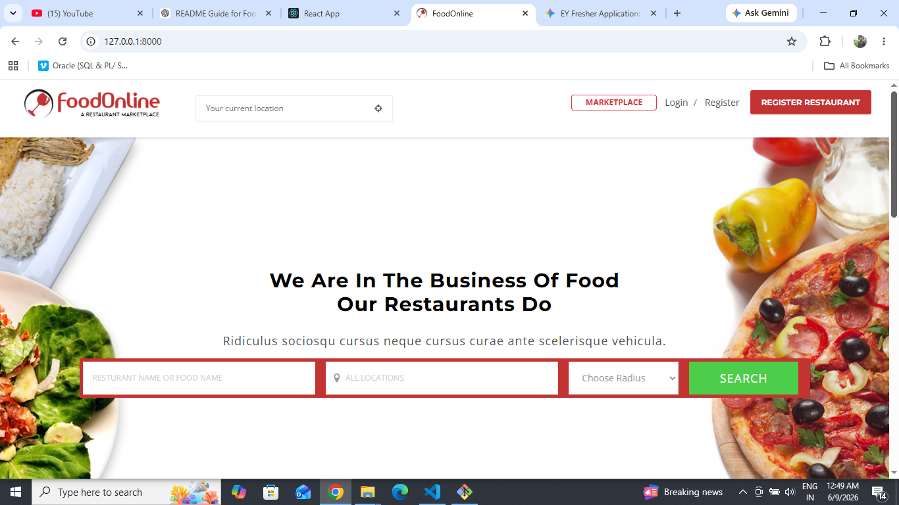
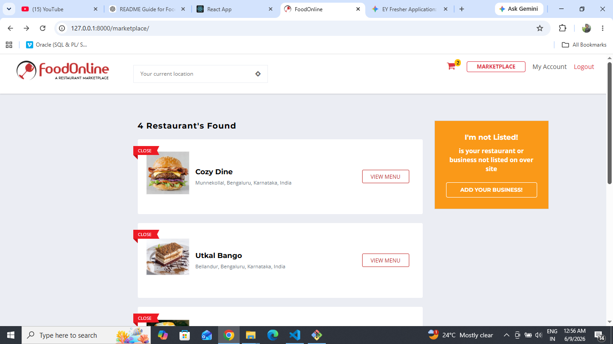
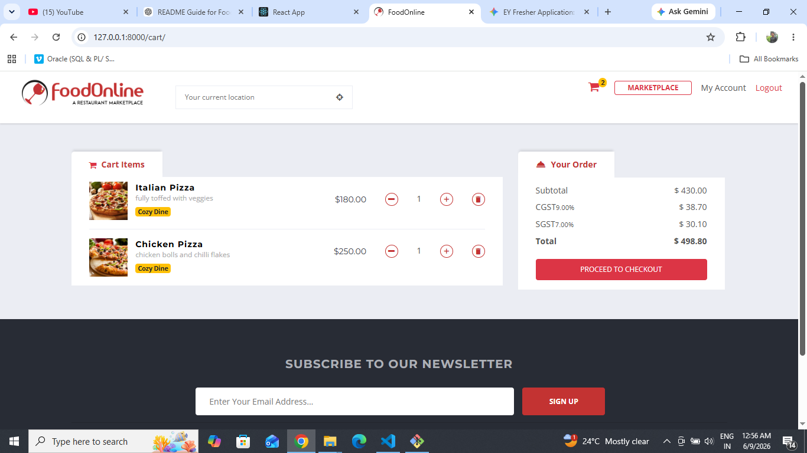
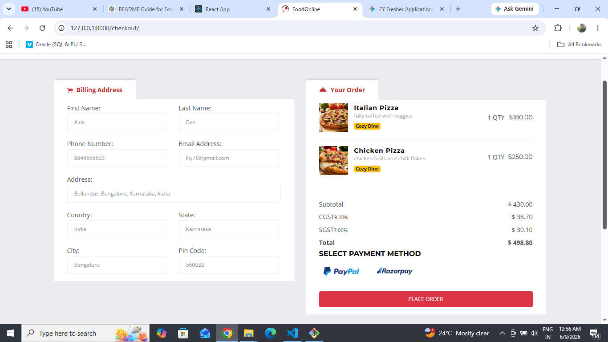
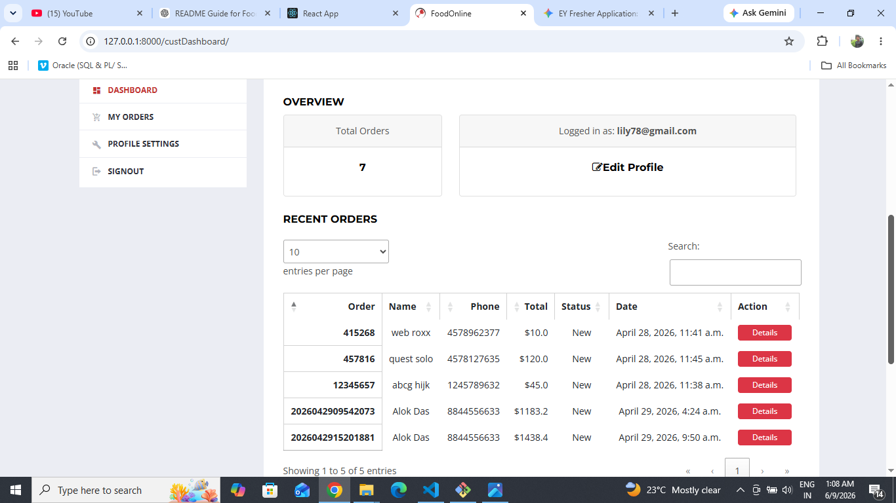
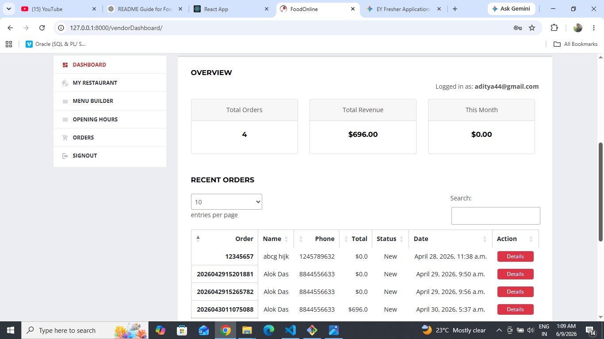

# FoodOnline - Multi Vendor Food Ordering System

FoodOnline is a full-stack Django web application that enables customers to browse restaurants, order food online, and track their orders. Vendors can manage restaurant profiles, food menus, and incoming orders through a dedicated dashboard.

## Links

🚀 **Live Demo:** [Visit FoodOnline](https://djangofoodonline.duckdns.org/)

💻 **Source Code:** [GitHub Repository](https://github.com/githubpractice12345/foodonline)

## Features

### Customer Features

- User Registration & Authentication
- Browse Restaurants
- Search Food Items
- Add Items to Cart
- Secure Checkout
- Online Food Ordering
- Order Tracking
- Customer Dashboard
- Password Reset via Email
- Email Notifications for Account Activities

### Vendor Features

- Vendor Registration
- Restaurant Profile Management
- Food Menu Management
- Order Management Dashboard
- Business Hours Management
- Email Notifications for New Orders

### Admin Features

- Vendor Approval & Management
- User Management
- Category Management
- Platform Monitoring

## Email Notification System

The application sends automated email notifications for:

- User Registration
- Password Reset Requests
- Successful Password Changes
- Order Placement Confirmation
- Payment Success Confirmation
- Vendor Account Approval
- New Order Notifications for Vendors

## Technology Stack

- Python
- Django
- HTML5
- CSS3
- Bootstrap
- JavaScript
- SQLite (Development)
- PostgreSQL (Production)
- Git & GitHub
- Linux
- Nginx
- Gunicorn

## Screenshots

### Home Page



### Restaurant Listing



### Cart



### Checkout



### Customer Dashboard



### Vendor Dashboard



## Note

The application includes a geolocation-based restaurant discovery feature using Google Maps APIs. This functionality is currently unavailable in the live deployment because the Google Cloud trial credits used for the Maps API have expired.

All other core features, including user authentication, food ordering, payment processing, email notifications, customer dashboards, and vendor management, are fully operational.

## Installation

### Clone the Repository

```bash
git clone https://github.com/githubpractice12345/foodonline.git
cd foodonline
```

### Create a Virtual Environment

```bash
python -m venv venv
```

### Activate the Virtual Environment

#### Windows

```bash
venv\Scripts\activate
```

#### Linux / macOS

```bash
source venv/bin/activate
```

### Install Dependencies

```bash
pip install -r requirements.txt
```

### Apply Migrations

```bash
python manage.py migrate
```

### Run the Development Server

```bash
python manage.py runserver
```

Open your browser and visit:

```text
http://127.0.0.1:8000/
```

## Project Structure

```text
foodonline/
│
├── accounts/
├── marketplace/
├── menu/
├── orders/
├── vendor/
├── static/
├── templates/
├── media/
├── screenshots/
├── manage.py
├── requirements.txt
└── README.md
```

## Future Enhancements

- Real-Time Order Tracking
- Coupon & Discount System
- SMS Notifications
- AI-Based Food Recommendations

## Author

**Anurup Biswal**

GitHub: https://github.com/githubpractice12345
